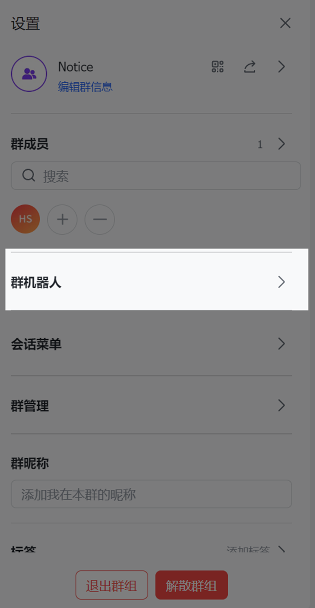
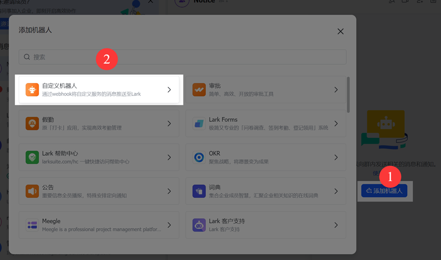
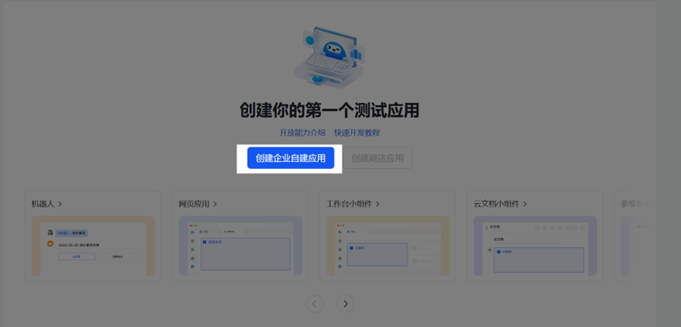
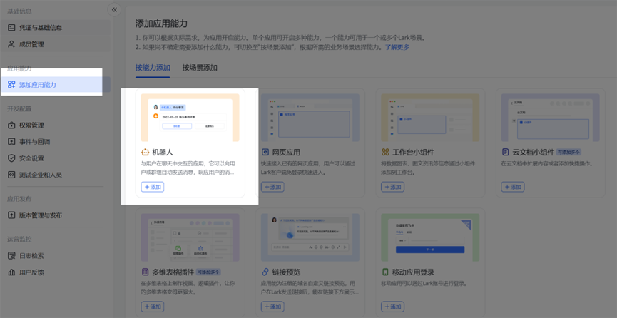
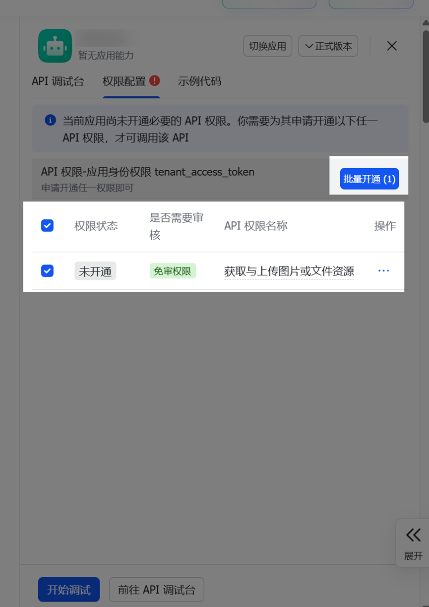

::: important

- 如果查看了本文档仍旧无法解决你的问题，可以在[Issue](https://github.com/OneDragon-Anything/ZenlessZoneZero-OneDragon/issues)查阅是否有相似问题，如果无相似问题可以通过Issue提问。

:::

> 文档说明：
> 1. 每个通知方式的文档都包含以下部分：
>    - `界面配置项`：列出在GUI界面上看到的具体选项名称
>    - `配置文件参数`：对应的配置文件参数及其说明
>    - `配置步骤`：详细的配置流程指导
> 2. 所有参数都标注了是否必填
> 3. 界面配置项与配置文件参数一一对应，方便查找
> 4. 本文档基于公开资料和代码实现整理，非所有内容都已100%证实；如发现问题，欢迎前往[官方频道](https://pd.qq.com/g/onedrag00n)或 ISSUE 区反馈。

## 目录
- [基础说明](#基础说明)
- [通知方式](#通知方式)
- [配置步骤](#配置步骤)
- [详细配置参数](#详细配置参数)
- [故障自助排查指南](#故障自助排查指南)
- [安全提示](#安全提示)


## 基础说明

一条龙通知系统支持多种通知方式，可以实现：
- 任务执行前的开始提醒
- 任务执行完成后的结果通知
- 支持带截图的消息推送
- 可以为每个功能单独配置是否通知

## 通知方式

目前支持以下通知方式(按推荐度排序)：
1. 特别推荐（新手首选）：
  - Server酱：配置最简单，支持微信接收
  - Bark：iOS设备专用，配置简单直观
  - pushplus：微信推送，配置简单

2. 推荐使用（稳定可靠）：
  - 钉钉机器人：企业级稳定性，配置简单
  - 飞书机器人：功能丰富，配置相对简单
  - 企业微信机器人：企业级服务，稳定可靠

3. 进阶使用（功能强大）：
  - OneBot(QQ机器人)：功能丰富，需要部署服务
  - 企业微信应用：企业级功能，需要管理权限
  - Telegram：国际化服务，需要特殊网络

4. 特殊需求：
  - Webhook：完全自定义，需要技术能力
  - SMTP邮件：传统方式，配置较复杂
  - Discord：国外服务，访问不稳定

## 配置步骤

### 1. 基础设置
1. 打开一条龙界面
2. 点击"设置" -> "通知推送"
3. 选择需要的通知方式
4. 填写对应的配置信息

### 2. 通知内容配置
- **自定义标题**: 可以设置通知的标题
- **是否发送截图**: 可以选择是否随通知一起发送游戏截图

### 3. 应用通知设置
可以为每个功能单独设置是否启用通知：
- 兑换码
- 影像店营业
- 刮刮卡
- 卦象集录
- 体力刷本
- 咖啡店
- 恶名狩猎
等...

### 4. 通知触发时机
- **开始前通知**: 可以选择是否在任务开始前发送通知
- **结束后通知**: 任务结束后默认会发送通知，包含成功/失败信息

## 详细配置参数

### 特别推荐（新手首选）

### 1. Server酱
推荐指数：⭐⭐⭐⭐⭐
特点：配置最简单，支持微信接收，免费使用，适合个人用户

#### 界面配置项
- `PUSH_KEY`: Server酱的发送密钥（必填）
  - 支持新版格式：`SCT123456...`（推荐）
  - 支持旧版格式：`SCU123456...`

#### 配置文件参数
```yaml
serverchan_push_key: "SCT123456..."  # 对应界面"PUSH_KEY"输入框
```

配置步骤：
1. 获取SendKey：
   - 访问 [Server酱官网](https://sct.ftqq.com/)
   - 登录后获取SendKey
2. 在一条龙设置界面：
   - 找到"PUSH_KEY"输入框
   - 填入获取的SendKey

注意事项：
- 免费版每天有额度限制
- 支持微信扫码绑定，接收更稳定
- 消息推送延迟很小

### 2. Bark
推荐指数：⭐⭐⭐⭐⭐
特点：iOS设备专用，配置极简，通知效果好

#### 界面配置项
- `推送地址或 Key`: 填写Bark推送密钥或完整地址（必填）
  - 方式1：填写从Bark APP获取的推送密钥
  - 方式2：填写自建服务器的完整URL
- `推送分组`: 消息分组名称（可选）
- `推送铃声`: 通知声音（可选）
- `推送图标`: 通知图标URL（可选）
- `推送中断级别`: 通知重要程度（可选）

#### 配置文件参数
```yaml
# 基础配置
bark_push: "xxxxxxxx"  # 推送密钥或完整地址

# 高级选项（可选）
bark_group: "分组名称"     # 对应"推送分组"输入框
bark_icon: "图标URL"      # 对应"推送图标"输入框
bark_sound: "铃声名称"     # 对应"推送铃声"输入框
bark_level: "active"      # 对应"推送中断级别"选择框
bark_archive: true        # 是否保存消息
bark_url: "打开的链接"     # 点击通知打开的URL
```

配置步骤：
1. 下载安装：
   - 在App Store搜索安装Bark
   - 或者自建服务器部署

2. 获取推送密钥：
   - 打开APP，直接复制显示的URL
   - 提取URL最后的密钥部分
   
3. 在一条龙设置界面填写：
   - 必填：`推送地址或 Key`
   - 可选：根据需要配置其他选项

注意事项：
- 仅支持iOS设备
- 可以自建服务器使用
- 支持丰富的通知效果

### 3. PushPlus
推荐指数：⭐⭐⭐⭐
特点：微信推送服务，配置简单，支持多种模板

#### 界面配置项
- `用户令牌`: PushPlus平台获取的Token（必填）
- `群组编码`: 群组消息编码（可选）
- `发送模板`: 消息格式模板（可选）
- `发送渠道`: 推送渠道选择（可选）
- `Webhook 编码`: 自定义渠道配置（可选）
- `发送结果回调地址`: 推送结果通知地址（可选）

#### 配置文件参数
```yaml
# 基础配置
push_plus_token: "your-token"      # 对应"用户令牌"输入框
push_plus_user: "username"         # 对应"群组编码"输入框

# 高级选项
push_plus_template: "html"         # 对应"发送模板"选择框
push_plus_channel: "wechat"        # 对应"发送渠道"选择框
push_plus_webhook: ""              # 对应"Webhook 编码"输入框
push_plus_callbackurl: ""         # 对应"发送结果回调地址"输入框
```

配置步骤：
1. 获取Token：
   - 访问 PushPlus 官网
   - 注册并登录
   - 复制个人中心的Token

2. 基础配置：
   - 填写Token到"用户令牌"输入框
   - 如需群发，填写群组编码

3. 高级配置（可选）：
   - 选择消息模板
   - 配置推送渠道
   - 设置回调地址

注意事项：
- 免费用户有API调用限制
- 支持多种消息模板
- 微信接收稳定可靠

### 推荐使用（稳定可靠）

### 1. 钉钉机器人
推荐指数：⭐⭐⭐⭐
特点：企业级服务，稳定可靠，安全性高

#### 界面配置项
基础配置（必填其一）：
- `Token`: 钉钉机器人的访问令牌
  - 从webhook地址中提取`access_token=`后面的部分

安全设置（推荐）：
- `Secret`: 钉钉机器人的签名密钥
  - 在机器人创建时选择"加签"可获得

#### 配置文件参数
```yaml
# 基础配置（必填其一）
dd_bot_token: "abc123..."     # 对应界面"Token"输入框

# 安全设置（推荐）
dd_bot_secret: "SEC123..."    # 对应界面"Secret"输入框
```

配置步骤：
1. 创建机器人：
   - 打开钉钉群 -> 智能群助手 -> 添加机器人
   - 选择"自定义机器人"
   - 推荐选择"加签"安全设置方式

2. 获取配置信息：
   - Token获取：
     - 复制webhook地址（格式：`https://oapi.dingtalk.com/robot/send?access_token=abc123`）
     - 提取`access_token=`后面的部分填入界面"Token"输入框
   
   - Secret获取（如果选择加签）：
     - 复制显示的加签密钥
     - 填入界面"Secret"输入框

注意事项：
- 推荐同时配置Token和Secret
- 使用加签可以提高安全性
- 注意消息发送频率限制

### 2. 飞书/Lark 机器人
推荐指数：⭐⭐⭐⭐
特点：功能丰富，支持多种消息格式

*先进团队，先用飞书*

#### 界面配置项
基础配置（仅文本消息）：
- `密钥`: 飞书机器人的webhook密钥（必填）
  - 从webhook地址中提取最后一段字符串

图片消息支持（可选）：
- `自建应用 App ID`: 用于发送图片的应用ID
- `自建应用 Secret`: 用于发送图片的应用密钥

#### 配置文件参数
```yaml
# 基础配置 - 仅文本消息
fs_key: "xxxxxx"      # 对应界面"密钥"输入框

# 可选配置 - 支持图片发送
fs_appid: "cli_xxx"   # 对应界面"自建应用 App ID"输入框
fs_appsecret: "xxx"   # 对应界面"自建应用 Secret"输入框
```

#### 配置步骤

可参考[使用自定义机器人发送飞书卡片](https://open.feishu.cn/document/feishu-cards/quick-start/send-message-cards-with-custom-bot)和[上传图片](https://open.feishu.cn/document/server-docs/im-v1/image/create)了解更多。

飞书和Lark的配置大同小异，但是网页端口不一致。

1. 登录飞书/Lark客户端并创建一个群聊。
   - 打开群聊的*设置*界面，
   
   - 点击*群机器人*，
   
   - 选择*添加机器人*>*自定义机器人*。
   
   - 复制webhook地址，如：`https://open.feishu.cn/open-apis/bot/v2/hook/abc123def456`


    ::: warning
    请妥善保存好此 webhook 地址，不要公布在 Gitlab、博客等可公开查阅的网站上，避免地址泄露后被恶意调用发送垃圾消息。你也可以增加 安全设置，以保证信息安全。
    :::


   - 提取最后一段`abc123def456`填入界面"Webhook地址后缀"输入框

2. 图片支持配置（可选）：
   - 访问[飞书开放平台](https://open.feishu.cn/app) 或[Lark开放平台](https://open.larksuite.com/app)
   - 创建或选择一个应用.
     
   - 点击"添加应用能力"页面，赋予*机器人*能力。
     
   - 前往[飞书上传图片api](https://open.feishu.cn/document/server-docs/im-v1/image/create) 或[Lark上传图片api](https://open.larksuite.com/document/server-docs/im-v1/image/create)，给予应用*上传图片*权限。
     
   - 保存后前往应用基础页面，记录下你的appid和appsecret，并点击*创建版本*。
     
   - 写点东西发版
     
   - 在一条龙app内
     - 复制"App ID"填入界面"自建应用 App ID"输入框
     - 复制"App Secret"填入界面"自建应用 Secret"输入框

### 3. OneBot (QQ机器人)

#### 界面配置项
服务配置：
- `请求地址`: go-cqhttp服务地址（必填，默认`http://127.0.0.1:5700`）
- `Token`: API访问令牌（可选，取决于go-cqhttp配置）

消息接收配置（至少填写一项）：
- `QQ 号`: 接收私聊消息的QQ号
- `群号`: 接收群聊消息的群号

#### 配置文件参数
```yaml
# 服务配置
onebot_url: "http://127.0.0.1:5700"  # 对应界面"请求地址"输入框
onebot_token: "your-access-token"     # 对应界面"Token"输入框

# 消息接收配置（至少配置一项）
onebot_user: "12345678"   # 对应界面"QQ 号"输入框
onebot_group: "87654321"  # 对应界面"群号"输入框
```

配置步骤：
1. 环境准备：
   - 确保go-cqhttp已正确安装和配置
   - 确保服务正常运行

2. 基础配置：
   - `请求地址`：
     - 本地部署填写：`http://127.0.0.1:5700`
     - 远程部署填写实际服务器地址
   - `Token`：
     - 如果go-cqhttp配置了访问令牌，需要填写
     - 否则可以留空

3. 消息接收配置（至少选择一项）：
   - 私聊消息：填写接收消息的QQ号
   - 群聊消息：填写接收消息的群号
   - 可以同时配置，消息会同时发送到私聊和群聊

4. 验证配置：
   - 使用一条龙的测试功能发送测试消息
   - 确认消息能正常接收


### 4. 企业微信

企业微信支持两种通知方式：应用消息和群机器人，可以选择其一配置。
> warning: 目前有社区反馈称应用消息实际需要企业认证，较难落地，请酌情考虑。

#### 企业微信应用 - 界面配置项
- `企业微信应用`: 填写以下参数，用逗号分隔（必填）：
  1. 企业ID
  2. 应用Secret
  3. 通知对象（@all表示所有人）
  4. 应用ID
  5. 图片ID（可选）

#### 企业微信机器人 - 界面配置项
- `企业微信机器人 Key`: 机器人webhook的key（必填）
- `企业微信代理地址`: 自定义API地址（可选）

#### 配置文件参数
```yaml
# 方式1：应用消息
qywx_am: "企业ID,应用Secret,通知对象,应用ID,图片ID"  # 对应界面"企业微信应用"输入框

# 方式2：群机器人
qywx_key: "abc123..."     # 对应界面"企业微信机器人 Key"输入框
qywx_origin: "自定义地址"  # 对应界面"企业微信代理地址"输入框
```

配置步骤：

1. 应用消息配置方式：
   - 登录企业微信管理后台
   - 在"应用管理"中创建/选择应用
   - 收集配置信息：
     1. 复制"企业ID"（在"我的企业"页面）
     2. 复制"Secret"（在应用详情页）
     3. 设置通知对象（@all或指定用户）
     4. 复制"AgentId"（在应用详情页）
     5. 如需发送图片，准备图片的media_id
   - 将以上信息用逗号连接，填入界面"企业微信应用"输入框

2. 群机器人配置方式：
   - 在企业微信群中添加群机器人
   - 获取webhook地址：`https://qyapi.weixin.qq.com/cgi-bin/webhook/send?key=abc123`
   - 提取key参数填入界面"企业微信机器人 Key"输入框
   - 如果使用自定义API地址，填入"企业微信代理地址"输入框

注意事项：
- 两种方式可以选择其一配置
- 应用消息支持更多功能，推荐使用
- 群机器人配置更简单，适合简单场景

### 5. Telegram

#### 界面配置项
基础配置（必填）：
- `BOT_TOKEN`: Telegram机器人Token
- `用户 ID`: 接收消息的用户或群组ID

代理配置（可选，国内用户建议配置）：
- `代理 URL`: 代理服务器地址
- `代理端口`: 代理服务器端口
- `API_HOST`: 自定义API地址

#### 配置文件参数
```yaml
# 基础配置（必填）
tg_bot_token: "123456:ABC-DEF1234..."  # 对应界面"BOT_TOKEN"输入框
tg_user_id: "123456789"                # 对应界面"用户 ID"输入框

# 代理配置（可选）
tg_proxy_host: "127.0.0.1"      # 对应界面"代理 URL"输入框
tg_proxy_port: "7890"           # 对应界面"代理端口"输入框
tg_api_host: "api.telegram.org" # 对应界面"API_HOST"输入框
```

配置步骤：

1. 创建机器人并获取Token：
   - 在Telegram中找到 @BotFather
   - 发送 `/newbot` 创建新机器人
   - 按提示设置机器人名称
   - 复制获得的Bot Token填入界面"BOT_TOKEN"输入框

2. 获取接收消息的ID：
   - 个人ID获取：
     * 找到 @userinfobot
     * 向其发送任意消息
     * 复制回复中的数字ID
   - 群组ID获取：
     * 将机器人加入群组
     * 在群组中发送消息
     * 通过API获取群组ID
   - 将获得的ID填入界面"用户 ID"输入框

3. 代理配置（国内用户）：
   - 准备代理服务器信息
   - 填写代理地址到"代理 URL"输入框
   - 填写代理端口到"代理端口"输入框
   - 如果使用自定义API地址，填入"API_HOST"输入框

注意事项：
- 国内用户需要配置代理才能正常使用
- 确保机器人已经与用户或群组建立了对话
- 测试时建议先用个人ID进行测试

### 6. Ntfy

#### 界面配置项
基础配置：
- `TOPIC`: 通知主题名称（必填）
- `URL`: ntfy服务器地址（可选，默认 ntfy.sh）
- `消息优先级`: 通知优先级（可选，1-5）

认证配置（可选其一）：
- `TOKEN`: 访问令牌认证
- 用户名密码认证：
  - `用户名称`: ntfy用户名
  - `用户密码`: ntfy密码

高级配置：
- `用户动作`: 自定义操作按钮配置

#### 配置文件参数
```yaml
# 基础配置
ntfy_topic: "your-topic"         # 对应界面"TOPIC"输入框
ntfy_url: "https://ntfy.sh"      # 对应界面"URL"输入框
ntfy_priority: "4"               # 对应界面"消息优先级"选择框

# 认证配置（选择其一）
ntfy_token: "tk_xxxx"            # 对应界面"TOKEN"输入框
# 或
ntfy_username: "user"            # 对应界面"用户名称"输入框
ntfy_password: "pass"            # 对应界面"用户密码"输入框

# 高级配置
ntfy_actions: "view,查看,https://example.com"     # 对应界面"用户动作"输入框
```

配置步骤：

1. 基础配置：
   - 确定使用的ntfy服务器：
     * 官方服务器：使用默认URL `https://ntfy.sh`
     * 自建服务器：填写您的服务器地址
   - 创建主题名称并填入"TOPIC"输入框
   - 根据需要设置消息优先级（1-5）：
     * 1：最低优先级
     * 2：低优先级
     * 3：普通优先级（默认）
     * 4：高优先级
     * 5：紧急优先级

2. 认证配置（根据服务器要求选择）：
   - 方式1 - 访问令牌：
     * 从ntfy服务获取访问令牌
     * 填入"TOKEN"输入框
   - 方式2 - 用户名密码：
     * 填写ntfy账户的用户名和密码
     * 分别填入"用户名称"和"用户密码"输入框

3. 高级配置（可选）：
   - 配置自定义操作按钮
   - 在"用户动作"输入框中填写按钮配置

注意事项：
- 确保主题名称在服务器上是唯一的
- 根据消息重要程度选择合适的优先级
- 使用官方服务器时注意流量限制


### 7. Webhook

#### 基础配置
```yaml
webhook_url: "http://your-webhook-url/path"  # Webhook地址
webhook_method: "POST"                       # 请求方法：GET或POST
webhook_content_type: "application/json"     # 内容类型
```

#### 请求头和请求体
```yaml
# 自定义请求头
webhook_headers: |
  {
    "Authorization": "Bearer your-token",
    "Custom-Header": "value"
  }

# 自定义请求体模板
webhook_body: |
  {
    "text": "${title}",
    "message": "${content}",
    "timestamp": "${timestamp}"
  }
```

支持的变量：
- `$title`, `{{title}}`: 通知标题
- `$content`, `{{content}}`: 通知内容 
- `$timestamp`, `{{timestamp}}`: 当前时间(YYYY-MM-DD HH:mm:SS)
- `$iso_timestamp`, `{{iso_timestamp}}`: ISO格式时间
- `$unix_timestamp`, `{{unix_timestamp}}`: UNIX时间戳
- `$image`: 图片base64编码(当提供图片时)

### 8. 邮件 (SMTP)

#### 界面配置项
基础配置（必填）：
- `SMTP服务器`: SMTP服务器地址
- `SMTP端口`: 服务器端口
- `发件人邮箱`: 用于发送邮件的邮箱地址
- `邮箱密码`: 邮箱密码或应用专用密码
- `发件人名称`: 发件人显示的名称

安全设置（根据服务器要求配置）：
- `启用SSL`: 是否使用SSL加密（true/false）
- `启用STARTTLS`: 是否使用STARTTLS加密（true/false）

#### 配置文件参数
```yaml
# 基础配置（必填）
smtp_server: "smtp.gmail.com"     # 对应界面"SMTP服务器"输入框
smtp_port: 587                    # 对应界面"SMTP端口"输入框
smtp_email: "your@email.com"      # 对应界面"发件人邮箱"输入框
smtp_password: "your-password"    # 对应界面"邮箱密码"输入框
smtp_name: "发件人名称"           # 对应界面"发件人名称"输入框

# 安全设置
smtp_ssl: "true"                 # 对应界面"启用SSL"选择框
smtp_starttls: "true"           # 对应界面"启用STARTTLS"选择框
```

#### 配置步骤
1. 准备邮箱配置信息，常见邮箱服务设置如下：

**Gmail邮箱**:
1. 基本配置：
   - SMTP服务器：`smtp.gmail.com`
   - 推荐：端口 `587` 且启用 STARTTLS（SSL 关闭）
   - 或者：端口 `465` 且启用 SSL（STARTTLS 关闭）
2. 特别设置：
   - 开启两步验证
   - 生成应用专用密码
   - 在密码栏填入应用专用密码

**QQ邮箱**:
1. 基本配置：
   - SMTP服务器：`smtp.qq.com`
   - SMTP端口：`465`
   - SSL：开启
   - STARTTLS：关闭
2. 特别设置：
   - 开启SMTP服务
   - 获取授权码
   - 在密码栏填入授权码

**163邮箱**:
1. 基本配置：
   - SMTP服务器：`smtp.163.com`
   - SMTP端口：`465`
   - SSL：开启
   - STARTTLS：关闭
2. 特别设置：
   - 开启SMTP服务
   - 获取授权码
   - 在密码栏填入授权码

注意事项：
- 不同邮箱服务的安全设置可能不同
- 建议使用授权码而不是邮箱密码
- 测试配置时先发送测试邮件验证

### 9. Gotify

#### 基础配置
```yaml
gotify_url: "http://your-gotify-server"  # Gotify服务器地址
gotify_token: "AXXXXXXXXXXXXXXXX"         # 应用令牌(token)
```

#### 消息选项
```yaml
gotify_priority: 5  # 消息优先级(1-10)，默认5
```

配置说明：
1. 部署Gotify服务器或使用现有服务器
2. 在Gotify创建应用获取token
3. 优先级说明：
   - 1-3: 低优先级
   - 4-7: 中等优先级
   - 8-10: 高优先级


### 10. 智能微秘书

该平台仅接受邀请注册

#### 基础配置
```yaml
aibotk_key: "your-api-key"    # API密钥
aibotk_type: "room"           # 发送类型：room(群聊)或contact(私聊)
aibotk_name: "接收者名称"      # 接收群聊或联系人名称
```

### 11. WxPusher

#### 基础配置
```yaml
wxpusher_app_token: "AT_xxxx"           # 应用Token
```

#### 接收配置(至少填写一项)
```yaml
wxpusher_topic_ids: "1111;2222;3333"    # 主题ID，分号分隔
wxpusher_uids: "UID_xxxx;UID_yyyy"      # 用户ID，分号分隔
```

配置说明：

1. 登陆 WxPusher 官网
2. 注册后创建应用，获取appToken
3. 网页上，用你的微信号扫二维码关注应用，在用户列表可以获取到UID
4. 该平台已经无法推送微信公众号，需要在公众号上点击推送服务->下载APP后接收

## 测试验证
推荐使用一条龙内置的测试功能进行验证。如需手动测试，请参考[故障自助排查指南](#故障自助排查指南)中的测试方法。

## 安全提示

### 1. 密钥保护
- 所有密钥、令牌都应妥善保管
- 建议使用环境变量或配置文件存储
- 定期更换敏感信息

### 2. URL安全
- webhook URL应使用HTTPS
- 添加访问控制和认证机制
- 避免在公开场合暴露完整URL

### 3. 错误处理
- 设置合理的超时时间
- 添加重试机制
- 记录错误日志

## 故障自助排查指南

### 1. 基础环境检查

#### 网络检查
1. **连通性测试**
```bash
# 测试基本网络连接
ping baidu.com

# 测试HTTPS连接
curl -I https://你的通知服务地址
```

2. **防火墙检查**
- 检查系统防火墙设置
- 检查杀毒软件是否拦截
- 确认代理设置（如果使用）

#### 配置文件检查
1. **文件权限**
```bash
# 检查配置文件权限
dir config\push.yml
```

2. **格式验证**
- 使用在线YAML校验工具
- 检查缩进是否正确
- 确认无中文符号

### 2. 故障诊断和解决方案

#### 常见状态码含义
- 401: 未授权，检查密钥
- 403: 权限不足
- 404: 接口不存在
- 500: 服务器错误
- timeout: 连接超时

#### 快速诊断步骤
1. 检查网络连通性
   - 使用`ping`测试基本连接
   - 使用`curl`测试HTTPS连接
   - 确认防火墙设置

2. 验证配置有效性
   - 检查密钥/Token正确性
   - 确认接口地址可访问
   - 验证配置文件格式

3. 服务状态检查
   ```powershell
   # 企业微信示例
   Invoke-WebRequest -Uri "https://qyapi.weixin.qq.com/cgi-bin/gettoken?corpid=您的ID&corpsecret=您的Secret"
   ```
