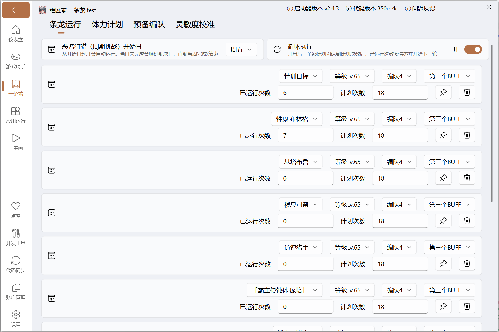

使用本页说明的功能时，建议阅读以下内容：
::: important

- **恶名狩猎** 配置的是 `恶名狩猎 周期挑战`，每周最多 `3` 次奖励次数，耗尽时会强制结束
- 其中 `恶名狩猎 周期挑战` 属于不用消耗电量的模式，单独维护一套配置
- 另外 `恶名狩猎 周期挑战` 与[体力计划](./charge_plan.md)里的 `恶名狩猎 深度追猎` 不是同一个模式
:::

## 功能说明

用于配置「恶名狩猎 周期挑战」的执行计划。脚本进入挑战页后会读取游戏内当前剩余次数，如果你已经手动打过几次，也会按真实剩余次数继续执行或结束。

## 配置说明

在「一条龙」页面点击 `恶名狩猎` 的 ⚙️ 图标进入配置。

1. 开始日
   - 从开始日起才会自动运行。当日未完成会顺延到次日，直到当周完成/结束。
   - 例子：设为周五时，周一到周四会跳过运行，从周五开始才会尝试运行。如果你当天意外程序关闭，后续几天会继续补跑，直到本周完成或本周结束。
2. 循环执行
   - 开启后，除本次已跳过的特训目标外，其余计划均已完成时会重置全部计划。
   - 普通计划的 `已运行次数` 按整轮扣减（减去 `计划次数`，超出部分保留）；已跳过的特训目标则直接清零 `已运行次数`。
3. 计划管理
   - 点击 `新增` 添加计划，拖拽可调整执行顺序。
   - 单条计划支持置顶或删除，脚本会按列表顺序尝试执行还没完成的计划。
   - `已运行次数 / 计划次数`：控制当前计划还要打多少次；`计划次数` 填 `0` 时，本轮不会执行这条计划。

