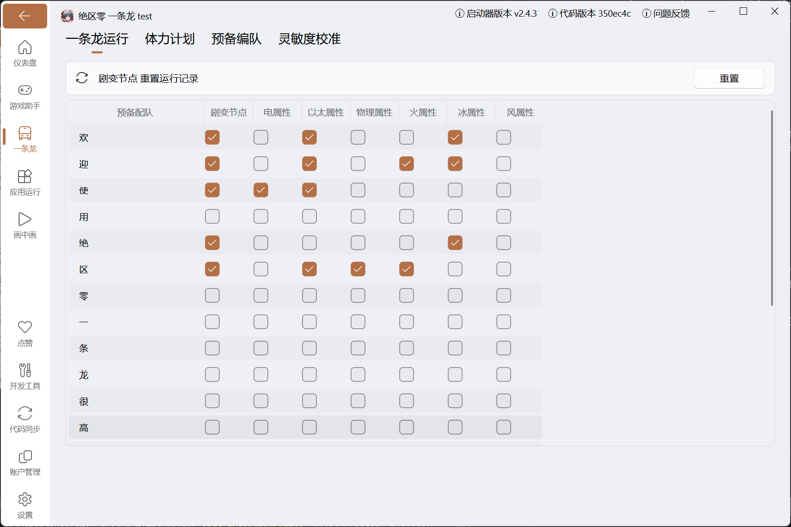

使用本页说明的功能时，建议阅读以下内容：
::: important

- 需要先完成[预备编队](./onedragon.md#预备编队)的配置
- 需要在式舆防卫战的设置页中的对应配队勾选是否参与剧变节点
- 需要在式舆防卫战的设置页中的对应配队尽量勾选可应对的弱点
:::

## 功能说明

式舆防卫战是游戏内的周期性挑战副本，一条龙可以自动帮你完成每期挑战。

跟随游戏内周期刷新（每周五）。脚本会根据当前画面和运行记录选择未完成节点继续；剧变第 5 节点的三间模式若已有得分，会先重置本节点再重新执行。

## 配置说明

### 1. 先配好预备编队

在「一条龙」页面点击「预备编队」，确保游戏内的编队名称与脚本中一致。

建议用中文名称，避免用纯数字命名（OCR 识别数字容易出错）。

### 2. 设置弱点配队

在「一条龙」页面点击式舆防卫战的 ⚙️ 图标进入配置。

可以看到一个表格，表格每行对应一个预备编队，列依次是「剧变节点」和游戏内的全部伤害类型。

**核心原则：保证每个弱点都至少有一个编队勾选了。**

### 3. 勾选剧变节点

只有勾了「剧变节点」这一列的编队才会进入剧变节点的配队计算。编队练度不够打高难度时，可以只让主力编队参与。

剧变节点出问题时，点页面顶部的「剧变节点 重置运行记录」的 `重置` 重新来过。

## 常见问题

脚本提示「配队未足够多阶段」，说明勾选的编队覆盖不了当前周期的所有弱点，回来检查每个弱点类型是否至少有一个编队能打。
